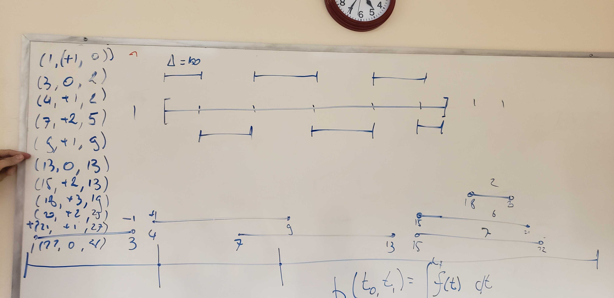

# Notes -  02/03/2020

### Whiteboard Notes

### Code Execution Trace
+ Making a Fenwick tree work
  - If all we need to do is count the total number of intervals in a range and know how may are contained within a certian interval

+ Plain sweep or line sweep
  - f(t)  is always a boring function
    + See picture
  - We only care about beginning and End
  - We have to sort them
  - Events of our line sweep
    + +1 and -1
    + +1 is beginning of Events
    + -1 is end of event
  - We get a sparse representation of the antiderivitive of f(t)
    + This is not quite working because we need to store the intergral of f(t)
    + We need to store a combination of things
    + But this is the general strategy
    + We do not subtract
      +   We need to keep a running total
  - New Idea
    + Store the integral of everything we have stored this far
    + (1, +1, 0)
    + (3, 0, 2) < last field we multiply difference between events two of (1st var) by the second var in the first event
    +  Array is sorted by events at which things happen
    + Log n time

  - Same for Gantt chart
    + Pixels are bins
    + Convert things into integrals from one side to the other
    + We could build a Fenwick tree on top of this
    + Looking for the location which proceeds the bin/pixel I want to draw into

  - Create a class/ function that takes in pixels of view and location to define the proper number of bins
  - Then calculates if a bin should be on or off and drawn
