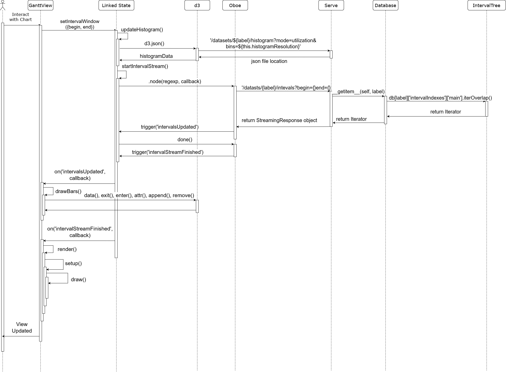

# Traveler Code Organization Report

## Sequence Diagram

# Frontend

### Zoom (GanttView.js)
1. User zooms into visualization. (USER INTERACTION)
2. Triggers bound `on('wheel')` function
  + [Github Link](https://github.com/hdc-arizona/traveler-integrated/blob/c7ae37938f2be033ddbc1d7e2ed6ba88e2acf109/static/views/GanttView/GanttView.js#L336)
3. `on('wheel')` calculates zoom factor, new bounds, "clamp window" clamping width to min of 10ms
4. `on('wheel')` function calls `this.linkedState.setIntervalWindow()` which begins update process
  + [Github Link](https://github.com/hdc-arizona/traveler-integrated/blob/c7ae37938f2be033ddbc1d7e2ed6ba88e2acf109/static/views/GanttView/GanttView.js#L351)

### Drag (GanttView.js)
1. User clicks, holds and drags Gantt chart
2. Drag functionality is managed by `d3.drag()` method and defined by three functions `on('start',()=>{})`,`on('drag',()=>{})`, and `on('end',()=>{})`
  + [Github Link](https://github.com/hdc-arizona/traveler-integrated/blob/c7ae37938f2be033ddbc1d7e2ed6ba88e2acf109/static/views/GanttView/GanttView.js#L370)
3. "Start" is used to defined initial drag state in the Gantt View scope
4. "Drag" calculates the shift based on the original drag state
5. "End" calls `this.linkedState.setIntervalWindow()`
  + [Github Link](https://github.com/hdc-arizona/traveler-integrated/blob/c7ae37938f2be033ddbc1d7e2ed6ba88e2acf109/static/views/GanttView/GanttView.js#L417)

### SetIntervalWindow (LinkedState.js)
1. `this.linkedState.setIntervalWindow()` is called
2. This method is defined in LinkedState.js and is a member of LinkedState class which acts as the model in Traveler's MVC architecture
  + [Github Link](https://github.com/hdc-arizona/traveler-integrated/blob/c7ae37938f2be033ddbc1d7e2ed6ba88e2acf109/static/models/LinkedState.js#L56)
3. This function calls three functions that update the model
  1. [`updateHistogram()`](https://github.com/hdc-arizona/traveler-integrated/blob/c7ae37938f2be033ddbc1d7e2ed6ba88e2acf109/static/models/LinkedState.js#L335)
  2. [`startIntervalStream()`](https://github.com/hdc-arizona/traveler-integrated/blob/c7ae37938f2be033ddbc1d7e2ed6ba88e2acf109/static/models/LinkedState.js#L219)
  3. [`startTraceBackStream()`](https://github.com/hdc-arizona/traveler-integrated/blob/c7ae37938f2be033ddbc1d7e2ed6ba88e2acf109/static/models/LinkedState.js#L276)

### UpdateHistogram (LinkedState.js)
1. `updateHistogram()` is wrapped in a timeout function of 100ms to provide debounce functionality
2. URLs for histogram data are defined
3. [Synchnorous call is made to retrieve data from api URLs using async `await`.](https://github.com/hdc-arizona/traveler-integrated/blob/c7ae37938f2be033ddbc1d7e2ed6ba88e2acf109/static/models/LinkedState.js#L351)
5. 'datasets/{label}/historgram' endpoint in serve.py calls a calulation function from a particular [interval index object](
https://github.com/alex-r-bigelow/intervaltree/blob/e2fd3447294b21977c063a28c77bc35ca7785de6/intervaltree/intervaltree.py#L1229)
4. Broadcasts histogram updated

### StartIntervalStream (LinkedState.js)
1. `startIntervalStream()` is wrapped in a timeout function again for debounce
2. Retrieves a histogram counting retrieved data to ensure that the interval is not too wide and therefore encompassing too much data
3. Uses [oboe library](http://oboejs.com/) to query a stream of data containing intervals we intend to draw
  + [Github Link](https://github.com/hdc-arizona/traveler-integrated/blob/c7ae37938f2be033ddbc1d7e2ed6ba88e2acf109/static/models/LinkedState.js#L252)
  1. Through oboe library query is made to API url: `/datasets/{label}/intervals?begin={begin of window}&end={end of window}`

# Backend
### Interval Stream API (serve.py)
1. Interval stream API is called using the Oboe library at a local URL. It is defined by the function [`intervals()` found in the serve.py file](https://github.com/hdc-arizona/traveler-integrated/blob/5397dc50ec4992a32a489bb6d32753b04c19c1cc/serve.py#L236)
2. This function returns a `StreamingResponse` object which defines the function `intervalGenerator()`
3. `intervalGenerator()` defines a for loop over all 'intervalIndex' records stored in this applications custom database
4. [Interval indexes are queried from the database using overloaded "[]" operators and the `iterOverlap()` function.](https://github.com/hdc-arizona/traveler-integrated/blob/5397dc50ec4992a32a489bb6d32753b04c19c1cc/serve.py#L248)

### Database (data_store/\_\_init\_\_.py)
1. This call stack continues into the database, defined in database.py (currently being refactored by Alex) through the line:
  + `for i in db[label]['intervalIndexes']['main'].iterOverlap(begin, end):`
2. This first `[]` evokes an overloaded `__getitem__` which returns a datset associated with a particular label
  + The datatype of this dataset was determined when the database was loaded by serve.py using [`db.load()`](https://github.com/hdc-arizona/traveler-integrated/blob/c80304293e60d380989ae1b4ba9c63416f64875f/data_store/__init__.py#L25) when started; at the 'intervalIndex' key it stores a reference to an interval tree stored in a pickled dictionary at the 'main' key

### IntervalTree (intervaltree.py)
1. The IntervalTree object specified in [intervaltree.py](https://github.com/alex-r-bigelow/intervaltree/blob/e2fd3447294b21977c063a28c77bc35ca7785de6/intervaltree/intervaltree.py#L1143) returned by `db[label]['intervalIndexes']['main']` contains the method `iterOverlap()`
2. The `iterOverlap()` defines a custom, recursive iterator over the IntervalTree object
3. This iterator is returned

### Interval Stream API (serve.py)
1. Per iterator returned by our interval stream we query a diskCache "Index" object stored in the [database at key 'intervals' under a particular label at the data bundling phase executed before running the visualization software.](https://github.com/hdc-arizona/traveler-integrated/blob/5397dc50ec4992a32a489bb6d32753b04c19c1cc/database.py#L391)
2. The data returned from our query is "yielded" by our Streaming response back to the front end Oboe call as a stringified dictionary.
  + [`yield json.dumps(db[label]['intervals'][i.data])`](https://github.com/hdc-arizona/traveler-integrated/blob/5397dc50ec4992a32a489bb6d32753b04c19c1cc/serve.py#L251)

# Frontend

### startIntervalStream (LinkedState.js)
1. A returned record representing an particular interval is returned and managed the [`.node()`](https://github.com/hdc-arizona/traveler-integrated/blob/5397dc50ec4992a32a489bb6d32753b04c19c1cc/static/models/LinkedState.js#L258) method which is part of the oboe library.
2. This method calls a method inherited from it's parent class, Model --  [`this.trigger()`](https://github.com/hdc-arizona/traveler-integrated/blob/5397dc50ec4992a32a489bb6d32753b04c19c1cc/static/node_modules/uki/dist/uki.esm.js#L62) -- to [broadcast an event 'intervalsUpdated'](https://github.com/hdc-arizona/traveler-integrated/blob/5397dc50ec4992a32a489bb6d32753b04c19c1cc/static/models/LinkedState.js#L266)
  + A different trigger is called when streaming is finished: [`this.trigger('intervalStreamFinished')`](https://github.com/hdc-arizona/traveler-integrated/blob/5397dc50ec4992a32a489bb6d32753b04c19c1cc/static/models/LinkedState.js#L273)
3. This triggers a callback defined in Gantt view.js

### setup (GanttView.js)
1. A callback function associated with 'newIntervalWindow' is defined in setup() using [`this.linkedState.on()`](https://github.com/hdc-arizona/traveler-integrated/blob/5397dc50ec4992a32a489bb6d32753b04c19c1cc/static/views/GanttView/GanttView.js#L97)
2. This callback function calls, with a debounce, the function `this.drawBars(this.linkedState.getCurrentIntervals)`

### drawBars (GanttView.js)
1. drawBars draws rectangles using [d3 datajoin pattern.](https://github.com/hdc-arizona/traveler-integrated/blob/5397dc50ec4992a32a489bb6d32753b04c19c1cc/static/views/GanttView/GanttView.js#L206)
2. Sets x and y coordinates with [transform translate](https://github.com/hdc-arizona/traveler-integrated/blob/5397dc50ec4992a32a489bb6d32753b04c19c1cc/static/views/GanttView/GanttView.js#L206)
3. Set's width and height [here](https://github.com/hdc-arizona/traveler-integrated/blob/5397dc50ec4992a32a489bb6d32753b04c19c1cc/static/views/GanttView/GanttView.js#L219)

### render/setup() (GanttView.js)
1. When streaming is finished, we do a full render by calling [`this.render()`](https://github.com/hdc-arizona/traveler-integrated/blob/5397dc50ec4992a32a489bb6d32753b04c19c1cc/static/node_modules/uki/dist/uki.esm.js#L158), an function defined in View class.
2. This function in turn calls [`this.setup()`](https://github.com/hdc-arizona/traveler-integrated/blob/5397dc50ec4992a32a489bb6d32753b04c19c1cc/static/views/GanttView/GanttView.js#L46), which is defined in GanttView.js
3. After setup(), render() calls draw(), which calls every drawing function
